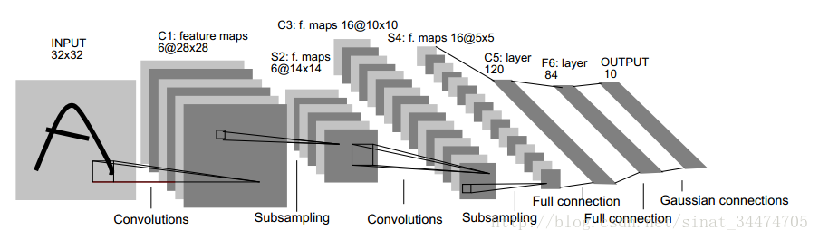
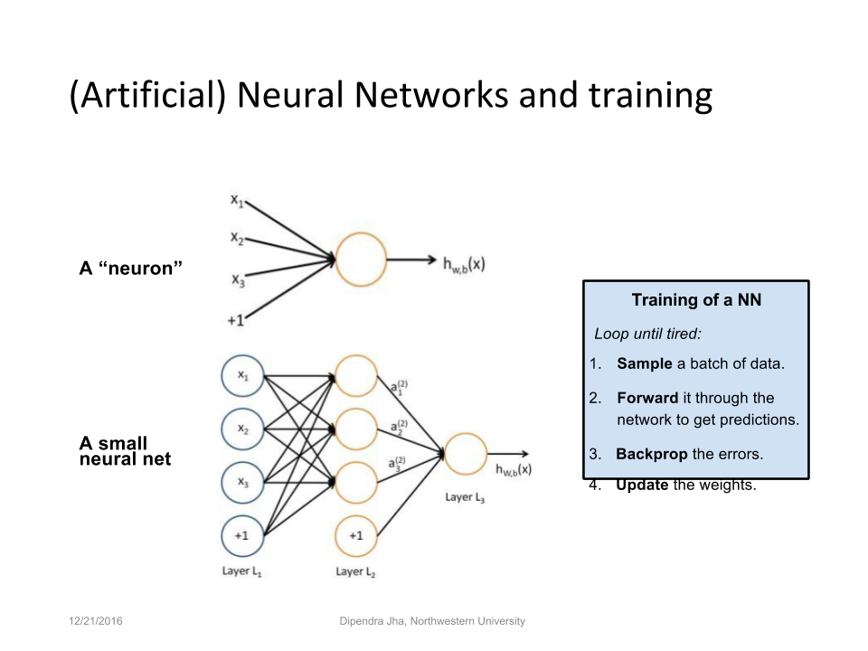

# LeNet-5

## 简介

LeNet-5 是由；Yann LeCun在1998年设计并提出来的，是一个用来识别手写数字的最经典的卷积神经网络。
这个模型虽然相对简单，但是非常具有代表性，它包含了构建卷积神经网络的一些基本组件，
精度方面，据说当年美国大多数银行就是用它来识别支票上的手写数字的，能够达到这种商用的地步，可见准确性已经相当高了。
如：卷积层，池化层（下采样层），全连接层。

[剖析手写数字识别器LeNet-5认识卷积网络](http://blog.csdn.net/lzhalan2016/article/details/52333126)
[卷积神经网络 LeNet-5各层参数详解](https://www.jianshu.com/p/ce609f9b5910)
[论文笔记：Notes on Convolutional Neural Networks](http://blog.csdn.net/sinat_34474705/article/details/56671238)

## 架构



## 论文解读

[INPUT] 输入图像是32*32的灰度图

[C1] 卷积层 共有6个28*28的特征图
输入图片：32*32

卷积核大小：5*5

卷积核种类：6

输出featuremap大小：28*28 （32-5+1）

神经元数量：28*28*6

可训练参数：（5*5+1）*6（每个滤波器5*5=25个unit参数和一个bias参数，一共6个滤波器）

连接数：（5*5+1）*6*28*28 = 122304



特征图是所在层的输出结果，也是下一层的输入。
卷积神经网络的精髓在于引进了局部感受野的概念，降低了计算成本而又能达到很高的精度。
每个神经元（圆圈部分）可以看作一个滤波器，也就是局部感受野。
滤波器的尺寸： 32-28+1 * 32-28+1 = 5 * 5
滤波器共享一个权值
32: 输入图像（特征图）
28: 输出特征图
1: 卷积核移动步长
5: 卷积核

每个滤波器的参数： 5*5 + 1 = 26

[S2] 下采样层 共有6个14*14的特征图
作用： 模糊图像，提高泛化性

输入：28*28

采样区域：2*2

采样方式：4个输入相加，乘以一个可训练参数，再加上一个可训练偏置。结果通过sigmoid

采样种类：6

输出featureMap大小：14*14（28/2）

神经元数量：14*14*6

可训练参数：2*6（和的权+偏置）

连接数：（2*2+1）*6*14*14

S2中每个特征图的大小是C1中特征图大小的1/4

[C3] 卷积层 共有16个10*10的特征图

输入：S2中所有6个或者几个特征map组合

卷积核大小：5*5

卷积核种类：16

输出featureMap大小：10*10

C3中的每个特征map是连接到S2中的所有6个或者几个特征map的，表示本层的特征map是上一层提取到的特征map的不同组合

存在的一个方式是：C3的前6个特征图以S2中3个相邻的特征图子集为输入。接下来6个特征图以S2中4个相邻特征图子集为输入。然后的3个以不相邻的4个特征图子集为输入。最后一个将S2中所有特征图为输入。

则：可训练参数：6*（3*25+1）+6*（4*25+1）+3*（4*25+1）+（25*6+1）=1516

连接数：10*10*1516=151600

[S4] 下采样层 共有16个5*5的特征图

输入：10*10

采样区域：2*2

采样方式：4个输入相加，乘以一个可训练参数，再加上一个可训练偏置。结果通过sigmoid

采样种类：16

输出featureMap大小：5*5（10/2）

神经元数量：5*5*16=400

可训练参数：2*16=32（和的权+偏置）

连接数：16*（2*2+1）*5*5=2000

S4中每个特征图的大小是C3中特征图大小的1/4

[C5] 卷积层 共有120个1*1的特征图

输入：S4层的全部16个单元特征map（与s4全相连）

卷积核大小：5*5

卷积核种类：120

输出featureMap大小：1*1（5-5+1）

可训练参数/连接：120*（16*5*5+1）=48120

[F6] 全连接层 共有84个1*1的特征图

输入：c5 120维向量

计算方式：计算输入向量和权重向量之间的点积，再加上一个偏置，结果通过sigmoid函数

可训练参数:84*(120+1)=10164

## keras实现

```python
# initialize the model
model = Sequential()

# first set of CONV => RELU => POOL
model.add(Convolution2D(20, 5, 5, border_mode="same",input_shape=(depth, height, width)))
model.add(Activation("relu"))
model.add(MaxPooling2D(pool_size=(2, 2), strides=(2, 2)))

# second set of CONV => RELU => POOL
model.add(Convolution2D(50, 5, 5, border_mode="same"))
model.add(Activation("relu"))
model.add(MaxPooling2D(pool_size=(2, 2), strides=(2, 2)))

# set of FC => RELU layers
model.add(Flatten())
model.add(Dense(500))
model.add(Activation("relu"))

# softmax classifier
model.add(Dense(classes))
model.add(Activation("softmax"))
```

## Tips

卷积核的种类当然可以自己定义。卷积核的种类对应了网络的广度，卷积层数对应了网络的深度。这两者对网络的拟合都有影响。但是在现代深度学习中，大家普遍认为深度比广度的影响更加高。卷积核种类过多可能会带来噪声的影响。